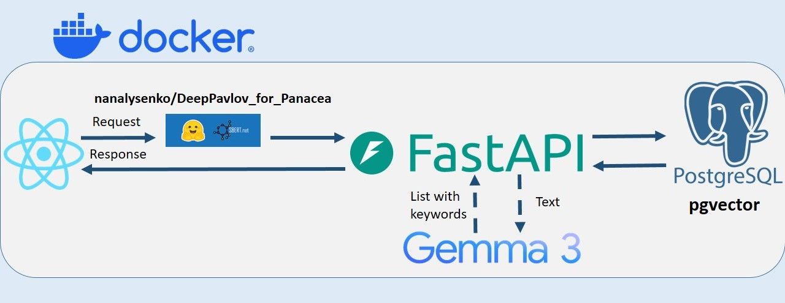
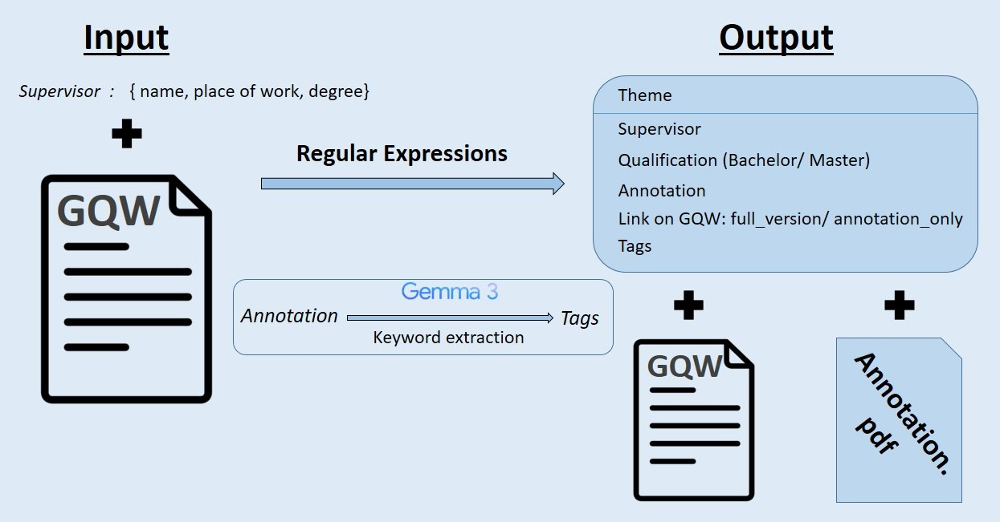
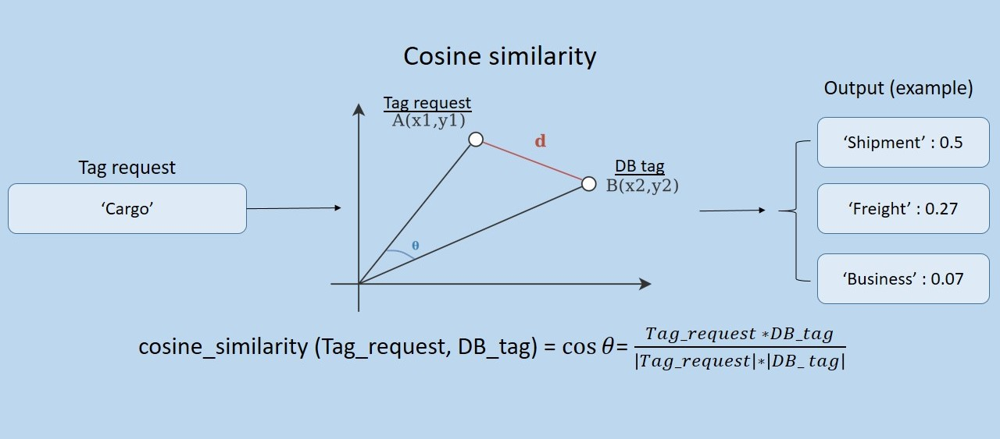

## Introduction
This repository is considered to be the tool to collect and sort Graduate Qualification works of students. It might be helpful for pre-graduate students, who are searching for a theme of their qualification work, and supervisors as well. 

*Image 1. Scheme of RepositoriumVKR Structure*
### Uploading GQW
Every GQW data field is extracted from the .pdf file with GQW by regular expressions, inter alia tags (in that project they might be called as keywords) are generated by [gemma-3-1b-it](https://huggingface.co/google/gemma-3-1b-it). </br>
The original .pdf file undergoes reduction of any personal data of graduate student and extraction sepate file with annotation text in Russian and English as well. 

*Image 2. Upload GQW Algo*
### MiniLM
MiniLM is used to map work's tags to vectors for tasks of semantic search (The [nanalysenko/DeepPavlov_for_Panacea](https://huggingface.co/nanalysenko/DeepPavlov_for_Panacea) is implemented). Algorithm of search near tag: each tag converted to vector show, compares to database vectors by cosine distance (1-cosine_similarity) from [pgvector extension](https://github.com/pgvector/pgvector?tab=License-1-ov-file#readme), after calculations tags with cosine similarity value more than 0.41 value are selected only.

*Image 3. Possible MiniLM Work in Project*
## Installation of dependencies
1. Firstly install necessary dependencies for Backend part.
```
 pip install -r Backend/requirements.txt
```
  or
```
 pip install fastapi
 pip install numpy
 pip install pydantic
 pip install scikit_learn
 pip install sentence_transformers
 pip install sqlalchemy
 pip install uvicorn
```
2. Next, there are some packages for Frontend:</br>
* If you have already installed node and npm (check it with node -v and npm -v in terminal)
```
npm install --silent
```
or
```
npm create vite@latest
```
- For Tailwind use command: 
```
npm install tailwindcss @tailwindcss/vite
```
  More about Tailwind CSS installation: [Installing Tailwind CSS with Vite](https://tailwindcss.com/docs/installation/using-vite)
- Also it is vital to upload Antd:
```
npm install antd --save
```
